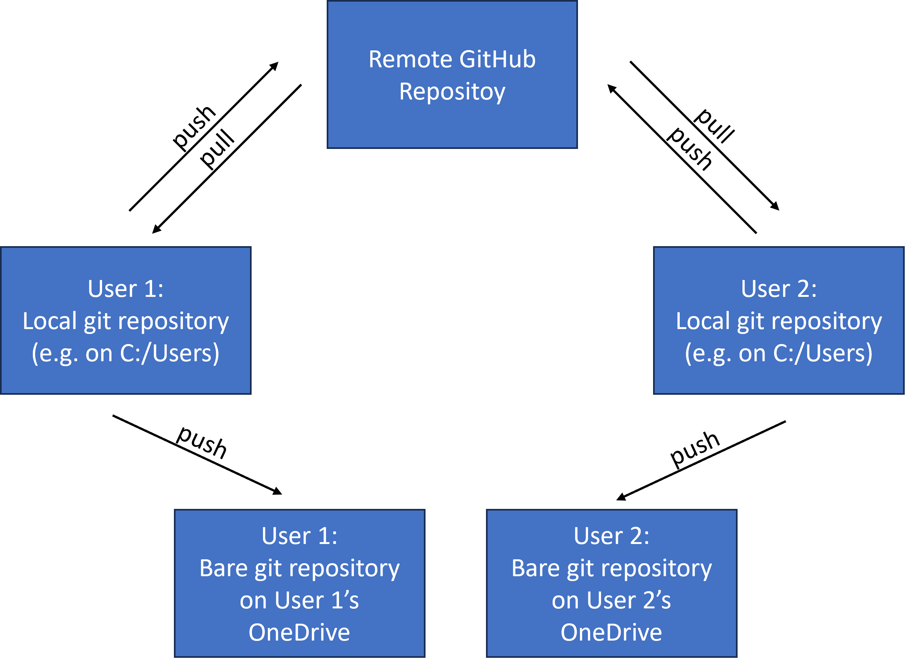

```{r setup, include=FALSE, echo=FALSE}
################################################################################
#Load packages
################################################################################
library("epar")
NOT_CRAN <- identical(tolower(Sys.getenv("NOT_CRAN")), "true")
knitr::opts_chunk$set(purl = NOT_CRAN, 
                      eval = NOT_CRAN,
                      fig.width = 4, 
                      fig.height = 4, 
                      tidy = TRUE,
                      dpi = 100)
```

```{r environ, echo=FALSE}
#key <- readRDS("../tests/testthat/key_file.rds")
#Sys.setenv(mapzen_key=key)
```

# TL;DR

If you have a GitHub and local git repository that is not on OneDrive (e.g. git repos and OneDrive are best to not be mixed!), we can set up a mirror on OneDrive that will satisfy records requirements because EPA does not consider GitHub repos as records.  Our files on OneDrive are records and are backed up.  

If you are working in R in the git repository (aside: An RStudio project would be an excellent way to manage this) you can do the following to set up a mirror repo on OneDrive.

First, make sure you have the `epar` pacakge installed from GitHub.

```{r eval=FALSE}
install.packages("pak")
pak::pkg_install("usepa/epar")
library(epar)
```

With that taken care of we can use the `add_mirror_repo()` and `one_drive_mirror()` functions to get everything set up.

```{r eval=FALSE}
mirror <- one_drive_mirror("projects")
add_mirror_repo(mirror)
```

For details read the rest!

# Records, OneDrive, and Github

Currently, files stored on EPA's Enterprise GitHub do not meet the requirements for records, therefore we need to find alternative means to make sure our GitHub based work is captured in a records friendly way.  The most widely used solution for saving digital files so that they comply with EPA records requirements is to use EPA's OneDrive.  For most files this is the default for EPA systems and a perfectly fine solution.  However, using OneDrive to store local git repositories is a problematic proposition.    

## Git and OneDrive

The are several potential problems with storing active local git repositories on OneDrive and they arise from OneDrive syncs and possible conflicts between git and OneDrive's version histories.  

First, since OneDrive is monitoring changes to folders and attempting to sync those changes to the cloud, any change to a large number of files has the potential to significantly tax you local computing resources.  If you use branches in your local git repository, anytime you switch branches that has the potential to change many file and folders in the repo and thus, OneDrive will try to sync everything to the cloud everytime you change branches.    

Second, OneDrive's built in version history is not git aware and thus if any changes occur to the same files on OneDrive it will rename those files.  This is fundamentally different than how git manages versions and these two approaches have the potential to conflict with one another.  This raises the possibility of corrupting your git version history.  

If you are working on a git repo on OneDrive with only yourself, the chance of this occurring is low; however, if you are working on a shared OneDrive location that is also a git repository, there is a much higher chance of corruption and if you have multiple users on a git repo on OneDrive and use a branching workflow, corruption of that repository is essentially assured.

# One Solution

One solution that will allow users to use git and GitHub while also maintaining records is to maintain your GitHub repository as a shared remote repository, work on a local git repository on a local drive (C: or external drive), and mirror this local repository to their OneDrive on each push.  This workflow is capture in Figure 1.


In order to use this workflow some alterations are needed for local repositories.  

- Clone local repository, as a "bare" repository, to a OneDrive location.
- Set up multiple "push" remotes in the local repository that first push to the GitHub remote, and then to the cloned "bare" repository on One Drive.
- Do not work directly on the "bare" repository on OneDrive.  This is simply a mirror that is at the same spot in the version control history as the last local push to GitHub.
- Do work, commit, and push changes per your normal git workflow on you local repository. Each push will send all committed changes first to GitHub, then to OneDrive.  No additional steps are required.
- If you need to recover files from the OneDrive mirror, it will need to be cloned with git to restore the files.

To set this all up in R, you may use the `add_mirror_repo()` and `one_drive_mirror()` functions in the `epar` package.  This function assumes and test that the repo you would like to mirror is an existing git repository.

```{r install_epar, eval=FALSE}
pak::pkg_install("usepa/epar")
library(epar)
```

With the latest version of the `epar` package installed from GitHub you can create the path for your mirror and then create it.  In the code below, I am setting up a mirror in a "projects" folder on my OneDrive the name of the mirror repo defaults to the name of the local repository.

```{r mirror}
my_mirror <- one_drive_mirror("projects")
my_mirror
```

Then you can set it up with:

```{r add_mirror, eval=FALSE}
add_mirror_repo(my_mirror)
```

And then to just make sure my remotes look correct run this from the terminal:

```{bash list_remotes, eval=FALSE}
git remote -v
```

```
## origin   https://github.com/USEPA/epar (fetch)
## origin   https://github.com/USEPA/epar (push)
## origin   C:\Users\JHollist\OneDrive - Environmental Protection Agency (EPA)\projects\epar (push)
```